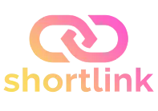

# ShortLink Frontend
<div align="center">



</div>

The frontend of the ShortLink application is built using Vite, React, and TailwindCSS. It provides an interface to generate short links, view link analytics, and manage private links.

## Technology Stack

-  **Vite**
-  **React**
-  **TailwindCSS**
## Running the Project

To run the frontend in development mode, follow these steps:

1. Install the dependencies by running:
```bash
   npm install or npm i
```

2. Start the development server with:
```bash
   npm run dev
```

The frontend will be available at [http://localhost:5173](http://localhost:5173).

## Optional: Connect to Backend

Ensure the backend is running before using the frontend. You can find backend setup instructions in the [main README](../README.md).

<br>

---

<div align="center">

### Connect with Me

[](https://www.linkedin.com/in/iheb-mejri)
[](https://www.ihebmejri.com/)
[](https://www.behance.net/Mejri-iheb)
[](https://medium.com/@iheb-mejri)

</div>
